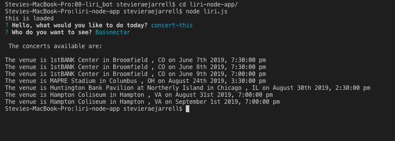

# liri-node-app

### Liri Searches Spotify for Songs, Bands in Town for concerts, and OMDB for Movies 

Liri is like SIRI but instead it interprets Language. Liri is a command line node app. So npm install node modules will be essential. This uses axios for retrieving Bands in Town, Spotify, and OMDB Api's. As well as moment to format the retrieved concets. If you would like this to work you will need your own .env that has your own Spotify API key. This also ses inquirer so that it formats LIRI with questions and answers. 

### What Liri Looks like to start off: 

  

Use the down arror key to select which thing you would like to do.

## concert-this 

Type in the band that you would like to see. In the example I chose Bassnectar. This includes the name of the venue, venue location, and the date of the event. 

  

## spotify-this-song 

This asks you what song you would like to find? This retrieves a list of potential artists, a preview link of the song from spotify, and the album name from where it came. In this case I used Raindrops Keep Falling On My Head 

  

    If no song is chosen it defaults to The Sign by The Ace of Base
   

  ## movie-this

This asks you what movie you would like to see. I chose "The Grinch as an example. 
This gives you a description of the title of the movie, the year the movie came out, the IMDB rating, the rotten tomatoes rating, the country it was produced, the language of the movie, the plot, and a list of actors from the movie.  

  

  If no movie is chosen it defaults to Mr.Nobody
   

## do-what-it-says

This uses the fs Node package to read the random.txt file. In the file I currently have written spotify-this-song,"My Bad". Therefore it gives you the artist, the song name, the link from spotify, and the album name from where it came. 

  

Once I change the text file to say movie-this,"Home Alone" 

It will populate the movie description of "Home Alone"

  

If you change it the .txt file to concert-this,Griz

 

